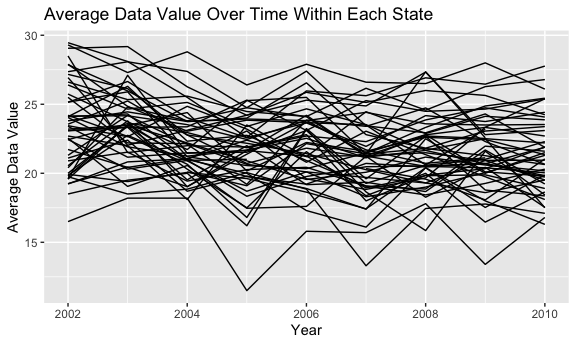
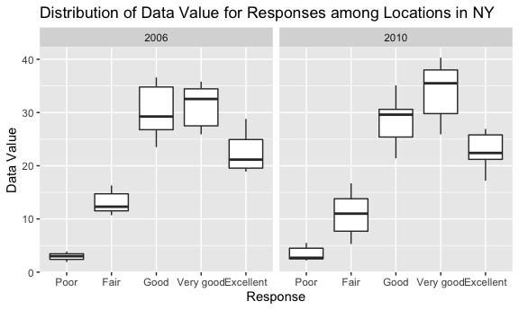
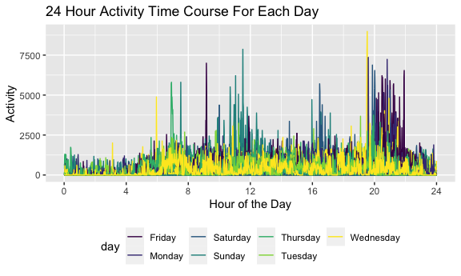

p8105\_hw3\_lcc2181
================

Loading packages needed for Homework 3 and adding code to format plots.

``` r
library(tidyverse)
library(p8105.datasets)

knitr::opts_chunk$set(
  fig.width = 6,
  fig.asp = .6,
  out.width = "90%"
)
```

## Problem 1

Loading instacart dataset for Problem 1

``` r
data("instacart")
```

There are 1384617 observations and 15 variables in the Instacart
dataset. Some key variables in the data set include `order_id`,
`product_id`, `order_dow`, `product_name`, and `aisle`. `order_dow`
describes what day of the week the order was placed. `product_name`
describes the name of the product and `aisle` describes the name of the
aisle. For example, the first observation in the dataset contains an
order for Bulgarian Yogurt from the yogurt aisle.

How many aisles are there and which aisles are the most items ordered
from?

-   Using the `count` function to count the number of aisles in the
    instacart data set, and the `distinct` function to remove duplicate
    aisles to ensure all aisles being counted are unique
-   Using the `group_by` function to group by aisle and `summarize` to
    summarize the total number of observations by aisle, assuming each
    observation in the data set represents an item ordered
-   Using `arrrange` to order in descending order, so that aisles will
    be listed in order most to least items ordered

``` r
count(distinct(instacart, aisle))
```

    ## # A tibble: 1 × 1
    ##       n
    ##   <int>
    ## 1   134

``` r
instacart %>% 
  group_by(aisle) %>% 
  summarize(number_of_items = n()) %>% 
  arrange(desc(number_of_items))
```

    ## # A tibble: 134 × 2
    ##    aisle                         number_of_items
    ##    <chr>                                   <int>
    ##  1 fresh vegetables                       150609
    ##  2 fresh fruits                           150473
    ##  3 packaged vegetables fruits              78493
    ##  4 yogurt                                  55240
    ##  5 packaged cheese                         41699
    ##  6 water seltzer sparkling water           36617
    ##  7 milk                                    32644
    ##  8 chips pretzels                          31269
    ##  9 soy lactosefree                         26240
    ## 10 bread                                   23635
    ## # … with 124 more rows

There are 134 aisles. The most items are ordered from the “fresh
vegetables” aisle (150609) followed by the “fresh fruits” aisle
(150473).

Making a plot showing number of items ordered in each aisle. The plot is
limited to aisles with more than 10000 items ordered.

-   Using `group_by` to group by aisle\_id and `summarize` to count the
    total number of observations by aisle\_id, assuming each observation
    (row) represents an item ordered
-   Using `filter` to restrict to aisles with more than 10,0000 items
    ordered
-   Using `ggplot` to create a plot with aisle\_id on the x-axis and
    number\_of\_items on the y-axis

``` r
instacart %>% 
  group_by(aisle_id) %>% 
  summarize(number_of_items = n()) %>% 
  filter(number_of_items > 10000) %>% 
  ggplot() +
  geom_bar(mapping = aes(x = aisle_id, y = number_of_items), stat = "identity") +
  labs(
    title = "Number of Items Ordered In Each Aisle",
    x = "Aisle ID",
    y = "Number of Items Ordered"
  )
```


In this plot, I can see the number of items ordered across the different
aisles, shown by their aisle ID on the x-axis. The plot is limited to
only aisles in which over 10,000 items were ordered, so there are 39
aisles represented. There are two aisles which appear to have a much
greater number of items ordered in those aisles compared with the other
aisles (for both of these aisles, the number of items ordered is over
150,000).

Making a table showing the three most popular items in each of the
aisles “baking ingredients”, “dog food care”, and “packaged vegetables
fruits”, including the number of times each item is ordered.

-   Using `filter` to filter the data set to the three aisles - “baking
    ingredients”, “dog food care”, and “packaged vegetables fruits”
-   Using `group_by` to group the observations by aisle and
    product\_name
-   Using `summarize` to count the total number of observations by
    aisle, assuming each observation (row) represents an item ordered
-   Using `filter` to filter to those with a ranking of less than 4 (so,
    a ranking of 1, 2, or 3) as determined by using the `min_rank`
    function with descending n\_items to ensure that those most number
    of items are ranked as highest
-   Using `select` to ensure that the variables aisle, product\_name,
    and n\_items are included in the table
-   Using `arrange` to order the table by aisle and most to least number
    of items in each aisle
-   Using `knitr::kable()` to convert the table into a reader-friendly
    format

``` r
instacart %>% 
  filter(
    aisle %in% c("baking ingredients", "dog food care", "packaged vegetables fruits")) %>%
  group_by(aisle, product_name) %>% 
  summarize(n_items = n()) %>% 
  filter(min_rank(desc(n_items)) < 4) %>% 
  select(aisle, product_name, n_items) %>% 
  arrange(aisle, desc(n_items)) %>% 
  knitr::kable()
```

    ## `summarise()` has grouped output by 'aisle'. You can override using the `.groups` argument.

| aisle                      | product\_name                                 | n\_items |
|:---------------------------|:----------------------------------------------|---------:|
| baking ingredients         | Light Brown Sugar                             |      499 |
| baking ingredients         | Pure Baking Soda                              |      387 |
| baking ingredients         | Cane Sugar                                    |      336 |
| dog food care              | Snack Sticks Chicken & Rice Recipe Dog Treats |       30 |
| dog food care              | Organix Chicken & Brown Rice Recipe           |       28 |
| dog food care              | Small Dog Biscuits                            |       26 |
| packaged vegetables fruits | Organic Baby Spinach                          |     9784 |
| packaged vegetables fruits | Organic Raspberries                           |     5546 |
| packaged vegetables fruits | Organic Blueberries                           |     4966 |

This table shows the three most popular items in each of the aisles
“baking ingredients”, “dog food care”, and “packaged vegetables fruits”.
In the “baking ingredients” aisle, the most popular item is Light Brown
Sugar followed by Pure Baking Soda and then Cane Sugar. In the “dog food
care” aisle, the most popular item is Snack Sticks Chicken & Rice Recipe
Dog Treats. The second most popular item in the dog food aisle is
Organix Chicken & Brown Rice Recipe and the third most popular item is
Small Dog Biscuits. In the “packaged vegetables fruits” aisle, the three
most popular items are Organic Baby Spinach, Organic Raspberries, and
Organic Blueberries.

Making a table showing mean hour of day at which Pink Lady Apples and
Coffee Ice Cream are ordered each day of week.

-   Using `filter` to limit the table to the products “Pink Lady Apples”
    and “Coffee Ice Cream”
-   Using `mutate` to convert the order\_dow variable into day names
    rather than numbers using the `recode` function, assuming that
    Sunday represents day 0
-   Using `group_by` to group by order\_dow and product\_name
-   Using `summarize` to create a new variable mean\_hour\_of\_day which
    takes the mean value of the order hour of day
-   Using `pivot_wider` to convert format of table so that order\_dow
    becomes columns taking on values from mean\_hour\_of\_day variable
    created in the previous step
-   Using `relocate` to order the table with product\_name first
    followed by days of the week in chronological order
-   Using `knitr::kable()` to convert the table into a reader-friendly
    format

``` r
instacart %>% 
  filter(product_name %in% c("Pink Lady Apples", "Coffee Ice Cream")) %>% 
  mutate(order_dow = recode(order_dow,
    `0` = "Sunday", `1` = "Monday", `2` = "Tuesday", `3` = "Wednesday", 
    `4` = "Thursday", `5` = "Friday", `6` = "Saturday")) %>% 
  group_by(order_dow, product_name) %>%
  summarize(mean_hour_of_day = mean(order_hour_of_day)) %>% 
  pivot_wider(
    names_from = order_dow,
    values_from = mean_hour_of_day
  ) %>%
  relocate(product_name, Sunday, Monday, Tuesday, Wednesday, Thursday, Friday, Saturday) %>% 
  knitr::kable()
```

| product\_name    |   Sunday |   Monday |  Tuesday | Wednesday | Thursday |   Friday | Saturday |
|:-----------------|---------:|---------:|---------:|----------:|---------:|---------:|---------:|
| Coffee Ice Cream | 13.77419 | 14.31579 | 15.38095 |  15.31818 | 15.21739 | 12.26316 | 13.83333 |
| Pink Lady Apples | 13.44118 | 11.36000 | 11.70213 |  14.25000 | 11.55172 | 12.78431 | 11.93750 |

This table shows the mean hour of the day at which Pink Lady Apples and
Coffee Ice Cream are ordered for each day of the week. For every day of
the week except for Friday, the mean hour of day in which Pink Lady
Apples are ordered is earlier than the mean hour of the day in which
Coffee Ice Cream is ordered.

## Problem 2

Loading the BRFSS data for Problem 2

``` r
data("brfss_smart2010")
```

Cleaning the BRFSS data and assigning to new data frame `brfss_df`:

-   Using `janitor::clean_names()` to format the variable names
    appropriately
-   Using `rename` to change the variable name “locationabbr” to “state”
    and “locationdesc” to “location”
-   Using `filter` to focus only on the “Overall Health” topic
-   Using `mutate` to convert response into a factor variable with 5
    levels ordered from “Poor” to “Excellent”

``` r
brfss_df =
  brfss_smart2010 %>% 
  janitor::clean_names() %>%
  rename(state = locationabbr, location = locationdesc) %>% 
  filter(topic == "Overall Health") %>% 
  mutate(response = factor(response, 
      levels = c("Poor", "Fair", "Good", "Very good", "Excellent")), 
      ordered = TRUE
  )
```

In 2002, which states were observed at 7 or more locations? What about
in 2010?

-   Using `filter` to filter to the correct year (2002 in the first code
    block and 2010 in the second)
-   Using `group_by` to group by state and `summarize` to count the
    number of distinct locations
-   Using `filter` to filter to states with 7 or more locations

``` r
brfss_df %>% 
  filter(year == 2002) %>% 
  group_by(state) %>% 
  summarize(n_locations = n_distinct(location)) %>% 
  filter(n_locations >= 7)
```

    ## # A tibble: 6 × 2
    ##   state n_locations
    ##   <chr>       <int>
    ## 1 CT              7
    ## 2 FL              7
    ## 3 MA              8
    ## 4 NC              7
    ## 5 NJ              8
    ## 6 PA             10

``` r
brfss_df %>% 
  filter(year == 2010) %>% 
  group_by(state) %>% 
  summarize(n_locations = n_distinct(location)) %>% 
  filter(n_locations >= 7)
```

    ## # A tibble: 14 × 2
    ##    state n_locations
    ##    <chr>       <int>
    ##  1 CA             12
    ##  2 CO              7
    ##  3 FL             41
    ##  4 MA              9
    ##  5 MD             12
    ##  6 NC             12
    ##  7 NE             10
    ##  8 NJ             19
    ##  9 NY              9
    ## 10 OH              8
    ## 11 PA              7
    ## 12 SC              7
    ## 13 TX             16
    ## 14 WA             10

In 2002, the states observed at 7 or more locations were CT, FL, MA, NC,
NJ, and PA. In 2010, the states observed at 7 or more locations were CA,
CO, FL, MA, MD, NC, NE, NJ, NY, OH, PA, SC, TX, and WA.

Constructing a data set limited to “Excellent” responses, containing
year, state, and a variable that averages data\_value across locations
within state. Making a spaghetti plot of this average value across time
within a state.

-   Filtering to only include response values of “Excellent”
-   Using `group_by` to group by state and year and `summarize` to
    create a new variable avg\_data\_value that takes the mean
    data\_value across locations within a state in a given year
-   Creating `ggplot` with year on x-axis and avg\_data\_value on y-axis
    and grouping by state to show a different line for each state

``` r
brfss_df %>% 
  filter(response == "Excellent") %>% 
  group_by(state, year) %>% 
  summarize(avg_data_value = mean(data_value)) %>% 
  ggplot(aes(x = year, y = avg_data_value, group = state)) +
  geom_line() +
  labs(
    title = "Average Data Value Over Time Within Each State",
    x = "Year",
    y = "Average Data Value"
  )
```

    ## `summarise()` has grouped output by 'state'. You can override using the `.groups` argument.

    ## Warning: Removed 3 row(s) containing missing values (geom_path).



The plot shows the average data value across the years 2002 to 2010 for
each state. Each state’s average data value is plotted in a separate
line. From this plot, we can see that the lowest average data value
occurred in 2005. Overall, it appears that the majority of average data
values during this period were between 15 and 30.

Making a two-panel plot (for the years 2006 and 2010) showing
distribution of data\_value for responses among locations in NY state

-   Using `filter` to filter to only NY state and to include the years
    2006 or 2010
-   Creating `ggplot` with response on x-axis and data\_value on
    y\_axis, adding `geom_boxplot()` to show distribution of data values
    for each response among locations in NY state, and adding
    `facet_grid` to split into a two-panel plot by year (2006 and 2010)

``` r
brfss_df %>% 
  filter(state == "NY", year %in% c(2006, 2010)) %>% 
  ggplot(aes(x = response, y = data_value)) +
  geom_boxplot() +
  facet_grid(. ~ year) +
  labs(
    title = "Distribution of Data Value for Responses among Locations in NY",
    x = "Response",
    y = "Data Value"
  )
```



This plot shows the response distribution of data values for responses
using a boxplot. Responses from 2006 and 2010 are separated into two
panels. In each panel, we can see the boxplot for each response value
(from “Poor” to “Excellent”). In each boxplot, we can see the median
data value as indicated by the line on the box plot as well as the
distribution of responses, including the min and max, as indicated by
the lines above and below the box. In both 2006 and 2010, responses of
“Poor” had the lowest median data value compared to other any other
response.

## Problem 3

Loading, tidying and wrangling the data for use in Problem 3

-   Using `read_csv` to load in the data file
-   Including a weekday vs. weekend variable by using `mutate` to create
    new variable weekday\_vs\_weekend which is created using `recode` to
    code days of the week
-   Using `pivot_longer` to display activity count at each minute shown
    as a new observation rather than as a separate column
-   Using mutate to convert new `minute` variable to numeric

``` r
accel_df =
  read_csv("data/accel_data.csv", show_col_types = FALSE) %>%
  mutate(
    weekday_vs_weekend = recode(day,
      "Monday" = "Weekday", "Tuesday" = "Weekday",  "Wednesday" = "Weekday",
      "Thursday" = "Weekday",  "Friday" = "Weekday", "Saturday" = "Weekend", 
      "Sunday" = "Weekend")
  ) %>% 
  pivot_longer (
    activity.1:activity.1440,
    names_to = "minute",
    names_prefix = "activity.",
    values_to = "activity"
  ) %>% 
  mutate(minute = as.numeric(minute))
```

The resulting dataset has 50400 observations and 6 columns. The
variables are week, day\_id, day, weekday\_vs\_weekend, minute, and
activity. There is an observation recording activity counts for each
minute of each day over the course of 35 days.

Creating a total activity variable for each day, aggregating across
minutes, and making a table showing these totals

-   Using `group_by` to group by day and week and `summarize` to create
    a new variable total\_activity which is sum of all activity
    observations from each minute of the day
-   Using `pivot_wider` to make the days of the week columns take on
    values from the newly created total\_activity variable, while weeks
    remain as rows
-   Using `relocate` to order days of the week in chronological order
-   Using `knitr::kable()` to make the table reader-friendly

``` r
accel_df %>% 
  group_by(day, week) %>% 
  summarize(total_activity = sum(activity)) %>% 
  pivot_wider(
    names_from = "day",
    values_from = "total_activity"
  ) %>% 
  relocate(week, Sunday, Monday, Tuesday, Wednesday, Thursday, Friday) %>% 
  knitr::kable()
```

    ## `summarise()` has grouped output by 'day'. You can override using the `.groups` argument.

| week | Sunday |    Monday |  Tuesday | Wednesday | Thursday |   Friday | Saturday |
|-----:|-------:|----------:|---------:|----------:|---------:|---------:|---------:|
|    1 | 631105 |  78828.07 | 307094.2 |    340115 | 355923.6 | 480542.6 |   376254 |
|    2 | 422018 | 295431.00 | 423245.0 |    440962 | 474048.0 | 568839.0 |   607175 |
|    3 | 467052 | 685910.00 | 381507.0 |    468869 | 371230.0 | 467420.0 |   382928 |
|    4 | 260617 | 409450.00 | 319568.0 |    434460 | 340291.0 | 154049.0 |     1440 |
|    5 | 138421 | 389080.00 | 367824.0 |    445366 | 549658.0 | 620860.0 |     1440 |

The individual’s total activity varies substantially by day. His highest
total activity is reported on the Monday in Week 3 (685910.00). One
trend I observed is that in the last two weeks (Week 4 and Week 5), the
individual records his lowest total activity level on Saturday, with the
individual having a total activity level of 1440 on both of the final
two Saturdays.

Making a single-panel plot that shows the 24-hour activity time courses
each day, using color to indicate day of the week.

-   Using `mutate` to divide the minute variable by 60 in order to
    convert minutes into hours
-   Creating a `ggplot` with hour on the x-axis and activity on the
    y-axis, grouped by day\_id, and colored by day of the week; adding
    `geom_line()` to create a line for each day
-   Additional code is added to format the plot, include making the
    scale of the x-axis increments by 4 up to 24, moving the legend to
    the bottom, and using the viridis color scheme

``` r
accel_df %>% 
  mutate(hour = minute/60) %>% 
  ggplot(aes(x = hour, y = activity, group = day_id, color = day)) +
  geom_line() +
  labs(
    title = "24 Hour Activity Time Course For Each Day",
    x = "Hour of the Day",
    y = "Activity"
  ) +
  scale_x_continuous(breaks = c(0, 4, 8, 12, 16, 20, 24))  +
  theme(legend.position = "bottom") +
  viridis::scale_color_viridis(
    name = "day", 
    discrete = TRUE
  )
```



Based on this graph, I can tell that the individual’s highest activity
count was over 8,750. I can also tell the day of week and hour of day in
which the individual achieved his highest activity count. Specifically,
this appears to have occurred on a Wednesday in the 19th hour of the
day. In general, it appears the individual often has relatively high
activity counts between the 20th and 22nd hours of the day, particularly
on Fridays. Additionally, regardless of day of the week, the individual
generally has relatively low activity counts in the first five hours of
the day.
